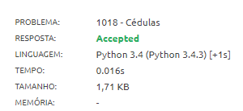

# Laboratório de Análise de Algorítmo - Aula 01

## Exercícios práticos

### 2. Cédulas [(URI 1018)](https://www.beecrowd.com.br/judge/pt/problems/view/1018)  
Leia um valor inteiro. A seguir, calcule o menor número de notas possíveis (cédulas) no qual o valor pode ser decomposto. As notas consideradas são de 100, 50, 20, 10, 5, 2 e 1. A seguir mostre o valor lido e a relação de notas necessárias.

**Entrada**  
O arquivo de entrada contém um valor inteiro **N** (0 < **N** < 1000000).

**Saída**  
Imprima o valor lido e, em seguida, a quantidade mínima de notas de cada tipo necessárias, conforme o exemplo fornecido.  

 

**Exemplo de entrada**  
576

**Exemplo de saída**  
576  
5 nota(s) de R$ 100,00  
1 nota(s) de R$ 50,00  
1 nota(s) de R$ 20,00  
0 nota(s) de R$ 10,00  
1 nota(s) de R$ 5,00  
0 nota(s) de R$ 2,00  
1 nota(s) de R$ 1,00  

 

#### My results

